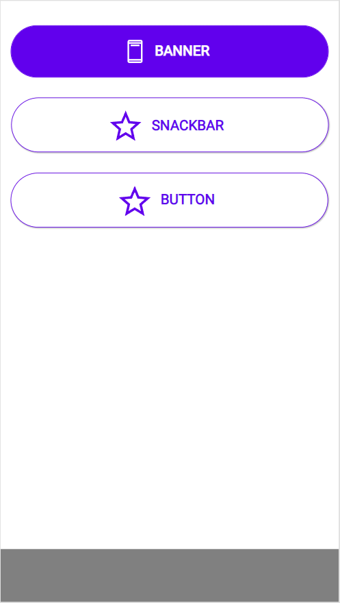

# Banner

## Description

A banner displays an important, succinct message, and provides actions for users to address (or dismiss the banner). It requires a user action to be dismissed.

## Demo

## Custom properties

| property | description |
| --- | --- |
| text | `string` main text of the dialog |
| twoButtons | `bool` true will show both buttons |
| actionBeneath | `bool` true will show the buttons beneath the text (better for mobile apps) |
| action1/2text | `string` available actions, Material Desing puts these in CAPITAL LETTERS, button width auto adjusts |
| action1/2onSelect | `behavioural Property` - onSelect actions of the 2 buttons |
| onHide | `behavioural Property` - is triggered, as soon as the banner hides (optional) |
| transitionAnimation| `bool` true will show an animation (putting this off can also be used for debug reasons) |
| transitionTime| `int` duration of transition in milliseconds |
| timerStart| `bool` put your Visible-variable or `Self.Visible` in here to start the animation |
| svgIcon | `string` but in svg-code from `<svg> to </svg>` or `null` - use every svg, without setting the fill properties, it will automatically add color, if you put nothing in there it will automatically center the text |
| textPaddingLeft | `int` in px - use to adjust the position of icon & text |
| yPostion (output property) | `int` this changes during transition and allows you to move the content down during transition |

## Tips and Tricks

* use the included icons from the template
* don't stack banners
* put the content of the page in a container and use the `yPostion`-property to get a transition effect
* don't forget to reset the variable for the `Visible`-property on the `action1/2onSelect`

## Known limitations

none

## Version

| Version | description |
| --- | --- |
| 1.0.0 | First version |

## Reference

https://material.io/components/banners
