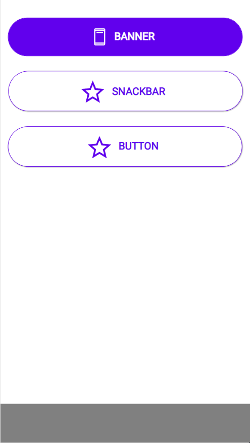

# Snackbar

## Description

Snackbars inform users of a process that an app has performed or will perform. They appear temporarily, towards the bottom of the screen. They shouldn’t interrupt the user experience, and they don’t require user input to disappear.

## Demo

## Custom properties

| property | description |
| --- | --- |
| text | `string` main text of the snackbar |
| twoButtons | `bool` true will show both buttons |
| actionBeneath | `bool` true will show the buttons beneath the text (better for mobile apps) |
| actionText | `string` available actions, Material Design puts these in CAPITAL LETTERS, button width auto adjusts |
| actionOnSelect | `behavioural Property` - onSelect actions of the button |
| onHide | `behavioural Property` - is triggered, as soon as the banner hides (optional) |
| transitionAnimation| `bool` true will show an animation (putting this off can also be used for debug reasons) |
| transitionTime| `int` duration of transition in milliseconds |
| duration| `int` duration of the snackbar in milliseconds |
| timerStart| `bool` put your Visible-variable or `Self.Visible` in here to start the animation |
| textPaddingLeft | `int` in px - use to adjust the position of icon & text |

## Tips and Tricks

* this is the only component, where the colors are inverted - the standards should work out
* use this to undo actions by the user (e.g. delete something)
* only one action is allowed
* set visibility to false on `onHide` to prevent it overlapping anything

## Known limitations

* none

## Version

| Version | description |
| --- | --- |
| 1.0.0 | First version |

## Reference

https://m2.material.io/components/snackbars
