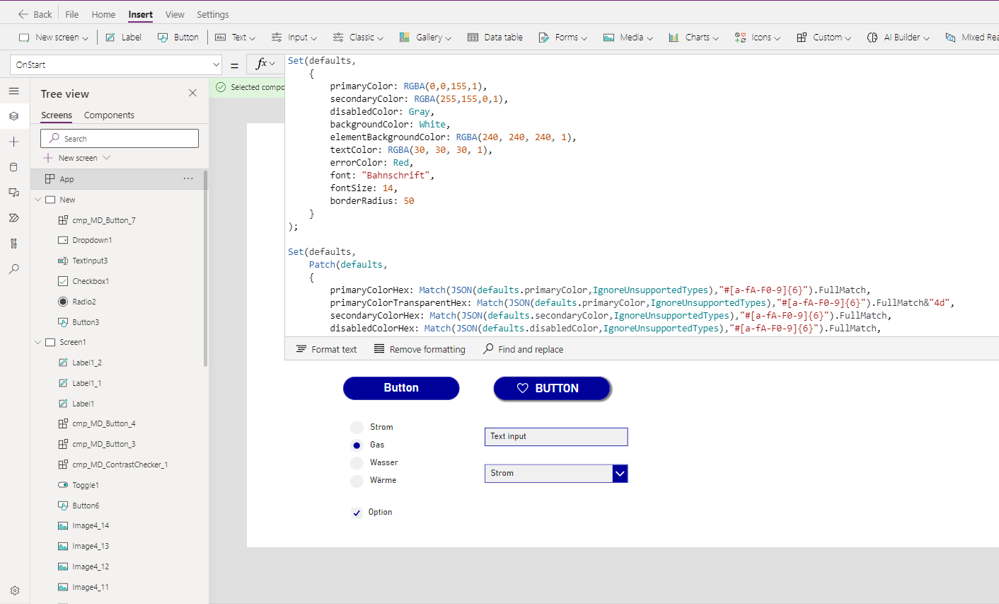

# Specs

## Description

The template should be your starting point for every new app. There are a few major and several minor differences to a normal empty canvas app.

1. All the necessary variables to define the colors and appearance of the components are stored in the `OnStart`-property of the app.
If you want a "normal" theme, just change the primaryColor and you are good to go.
2. Many absolute values in new elements (buttons, textinputs, labels, etc.) are exchanged for the variables that are defined in the `OnStart`-property. Example: The standard fill-property of a Button is `RGBA(56, 96, 178, 1)`, in the template it should be `defaults.primaryColor`. Therefore the standard elements match the components from the get go and you don't have to touch too many properties manually and can adjust them afterwards (change your primaryColor in the OnStart and the whole app should match that color).
3. There is a hidden collection of ~5000 Material-Design svg-Icons which is called `MaterialDesignIcons`. Look at the examples to see how you can access them.
4. Many Elements have their properties changed up a little bit to match the Material Design theme as closely as possible (some work better than others)

## Setup

1. Download the [msapp-file](../template/MaterialDesignTemplate.msapp)
2. head over to make.powerapps.com
3. select your environment
4. Click Create -> select Dataverse/SharePoint/Excel (doesn't matter, we won't actually use that - don't click "Blank app")
5. Open
6. Browse
7. select the msapp-File from your file system
8. first thing -> save under new name
9. add the app to your solution (you don't work in solutions? - go start now!)

## Demo
New controls and components from the library should automatically match your specified colors

## Tips and Tricks

* The first part of the `OnStart`-property is where you input the colors and settings you want to use. Some colors are calculated again in Hex-code to style the SVG-icons. You can use them inside html-Controls or svg-Images.
* You can introduce different themes like high contrast or dark mode and let the user choose which one they want to use (see examples)

## Known limitations

* When creating/editing components inside the template you have to enable to access App scope, otherwise all element properties throw errors

## Version

| Version | description |
| --- | --- |
| 1.0.0 | First version |

## Reference and credit

The techniques to create this template were discovered by [Sancho Harker](https://twitter.com/iAm_ManCat). Show him some love and tip him a coffee via paypal, if you can afford it. This will save you soooo mch time!

If you want to learn more visit [his blog](https://www.iammancat.dev/2022/01/power-apps-branding-template-v3/)